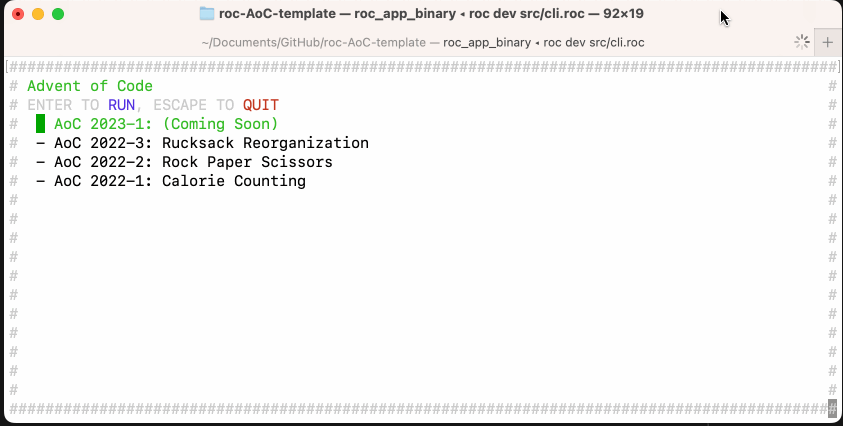
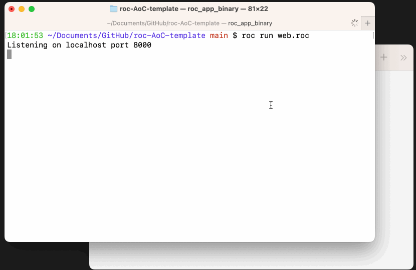

# Advent of Code Template 

A template for AoC puzzle solutions using [Roc](https://www.roc-lang.org) 🤘

Roc is a [fast](https://www.roc-lang.org/fast), [friendly](https://www.roc-lang.org/friendly), and [functional](https://www.roc-lang.org/functional) language which makes it ideal for this use case. 

## Setup

Clone this repository

## CLI App 

Compile fast with `roc dev src/cli.roc`

Optimized runtime with `roc build --optimize src/cli.roc && src/cli`



## Web App 🚧 **Work In Progress** 🚧

Run the webserver using `roc run src/web.roc`, then navigate to `localhost:8000` in a browser



## Adding Solutions

The solutions are located in a subfolder like `src/S2023/D01.roc`. To add another you can copy a previous solution, and then add it to the app by updating the following variable in the `src/App.roc` file.

```haskell
## Export a list of the solutions included in this app
solutions : List AoC.Solution
solutions = 
    [
        S2022.D01.solution,
        S2023.D01.solution,
        S2022.D03.solution,
        S2022.D02.solution,
    ]
    |> List.sortWith sortByYearAndDay
```
