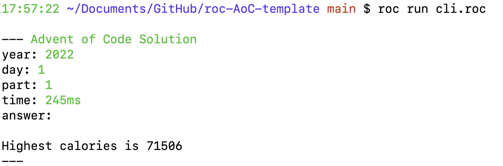

# Advent of Code Template 

A template for solving AoC puzzles using [Roc](https://www.roc-lang.org) 🤘

Roc is a fast, friendly, and functional language which makes it great for solving puzzles.

**STATUS:** Work In Progress 🚧

## Command Line Interface App 

Run the CLI app using `roc run cli.roc`

## Webserver App 

Run the webserver using `roc run web.roc`, then navigate to `localhost:8000` in a browser

